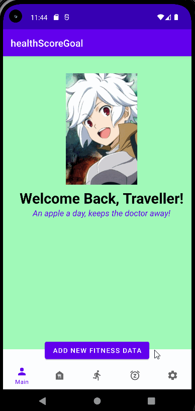
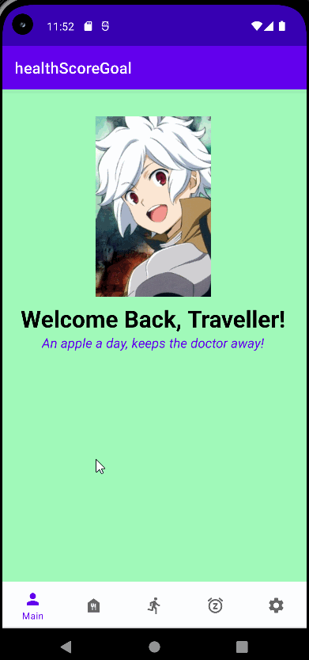
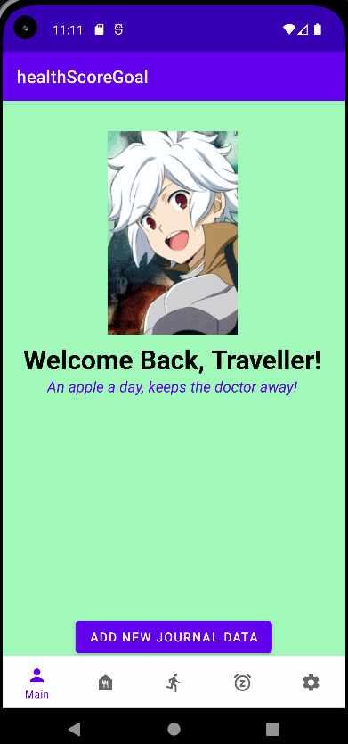
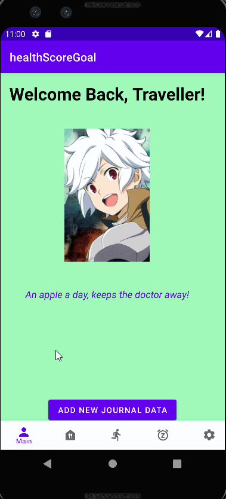

# Milestone 1 - Score Goal

## Table of Contents

1. [Overview](#Overview)
1. [Product Spec](#Product-Spec)
1. [Wireframes](#Wireframes)

## Overview
- Exercise Tracking
- Exercise Examples
- Food Tracking
- Settings
- Food examples(stretch)
- Sleep Tracking (stretch)

### Description

Our app is a general heath app made to keep our users bodies and minds in shape. Many features such as sleep and calorie counter will be used to achieve this!
Exercise chart will have multiple movements set specifically for the user to remember.
Calorie counter allows users to input whatever they choose to make sure they're getting an ideal intake.
Weekly activity keeps track of all the users activity during the week and compares them.
Other things such as exercise details and more will be added in.
Additional:
Sleep counter helps users keep track of their ZZZ's and assist them in getting the most beauty sleep they can.

### App Evaluation

- Category: Fitness & Health
- Mobile: Made to be used anywhere you have your phone to keep easy tracking of everything health related
- Market:Everyone
- Habit:Health, sometimes we just need to be able to keep track of everything to be able to better ourselves. Daily checkings lets you know what you can impove on
- Scope: V1 should have most of the basic layout done. Going on we continue to add other features till we meet our end goal.

## Product Spec

### 1. User Features (Required and Optional)

**Required Features**
- [x] Delete exercise data (all and specifics)
- [x] Exercise Examples and details
- [x] Calorie counter
- [x] Delete Calorie data (all and specifics)
- [x] Food recommendations & details
- [x] Sleep Tracker
- [x] Delete Sleep data (all and specifics)
- [x] All data delete
- [x] API parameters added in

**Stretch Features**
- [ ] User Page Overview
- [x] Partial logic check for API feeling to grab
- [ ] Weekly Activity & Exercise Details
- [ ] Lap counter
- [ ] Gps gym location
- [ ] User account stored online
- [ ] Exercise chart

### 2. Screen Archetypes

- Stream
  - User can view their workouts
  - User can view their calories intake
  - User can see differnt exercises 
- Detail
  - User can expand on exercises to see more
  - User can expand on dishes to see exact details
- Creation
  - User can post their workout, calories lost, and time
  - User can post foods and their calories
  - User can input sleep (Stretch)
- Stretch: Login & Register
  - User can create an account to store information online
  - User can login to get their information

### 3. Navigation

**Tab Navigation** (Tab to Screen)

* Home
* Dietary Section
* Fitness Section
* Settings

**Flow Navigation** (Screen to Screen)

- Home
  - Profile picture with data and other information
  
- Dietary Section
  - List of healthy foods/Articles
  - If user clicks on it, it will take them to the dish information / article

- Fitness Section
    - list of different workouts and exercises
    -  If user clicks on it, it will take them to the fitness information / article

- Settings
    - Where users can configure their app

## Wireframes

First week update gif:

Second week update gif:

Third week update gif:

Fourth week update gif:

Fifth week update gif:

Final week update gif:

